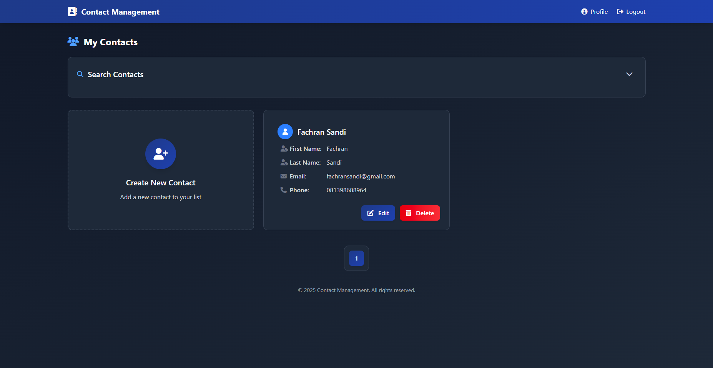
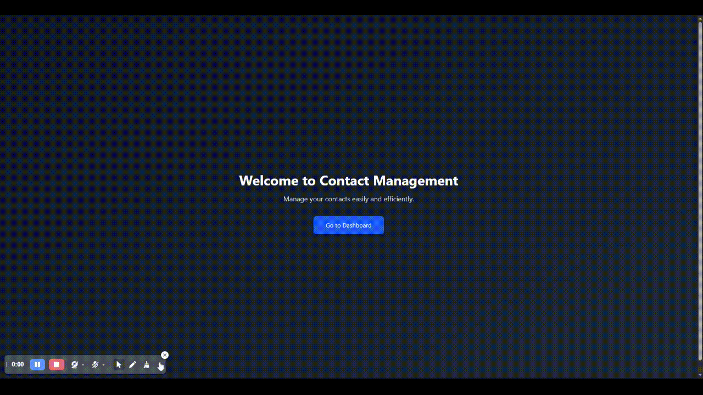

# 📇 Contact Management App

Aplikasi **Contact Management** berbasis web untuk mengelola kontak dengan validasi form yang real-time dan ketat menggunakan **React + Hook Form + Zod**.
Tujuan utama dibuatnya aplikasi ini adalah untuk menerapkan **form validation modern** dengan UX yang jelas dan interaktif.

Inspirasi project ini datang dari tutorial [Programmer Zaman Now](https://www.youtube.com/watch?v=aLsrruCFZFU&ab_channel=ProgrammerZamanNow), namun seluruh implementasi backend dan integrasi dibuat **dari nol**.

---

## ⚙️ Tech Stack

- **Frontend:** React, TypeScript, Hook Form, Zod, TailwindCSS
- **Backend:** Go (Golang) dengan REST API
- **State Management:** React Hooks
- **Validation:** Zod (Schema-based Validation)

---

## ✨ Features

- 🔑 **Form Validation Real-time** dengan Hook Form + Zod
- 👤 Tambah, edit, hapus, dan lihat daftar kontak
- 🔍 Validasi password kuat (uppercase, lowercase, simbol, minimal 6 karakter)
- 📡 Backend API dengan Golang untuk manajemen kontak
- 🎨 UI modern dengan TailwindCSS

---

## 📷 Preview



<!-- Tambahkan GIF demo di sini, contoh: -->



---

## 📥 Installation

Clone repository frontend:

```bash
git clone https://github.com/tiedsandi/project_typescript-contact-management.git
cd project_typescript-contact-management
npm install
npm run dev
```

Clone repository backend:

```bash
git clone https://github.com/tiedsandi/project_contact-management-go.git
cd project_contact-management-go
go run main.go
```

---

## 🚀 How to Run

1. Jalankan backend Go:

   ```bash
   go run main.go
   ```

2. Jalankan frontend React:

   ```bash
   npm run dev
   ```

3. Buka di browser: [http://localhost:5173](http://localhost:5173)

---

## 🌐 Personal Website

Jika kamu suka project ini, jangan lupa mampir ke website pribadiku 👉 [fachran-sandi.netlify.app](https://fachran-sandi.netlify.app/)
